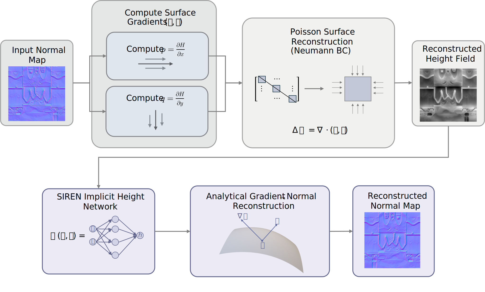

<div align="center">

# INR for Normal Map

**Implicit Neural Representations for Normal Map Compression and Reconstruction**

</div>

## Introduction

This repository provides a modular, tested implementation of a pipeline that compresses and reconstructs normal maps using Implicit Neural Representations with Periodic Activation Functions (SIREN).

Rather than fitting the full normal map directly with a SIREN, we convert the normal field (p, q) into a height field f_S(x, y) = h and fit this height field with a SIREN. This reduces training cost and allows a smaller network while preserving reconstruction quality.

Below is the pipeline diagram for the method:

<div align="center">



</div>

For more details and motivation, see the accompanying blog post: https://zhuanlan.zhihu.com/p/1995970351847474788

---

## Quick start

1. Clone the repository:

```bash
git clone https://github.com/FSMargoo/INR-normal.git
```

2. Create a Python virtual environment (recommended) and install dependencies:

```bash
python -m venv .venv
.\.venv\Scripts\activate  # Windows
pip install -r requirements.txt
```

3. Train a SIREN on a single normal map:

```bash
python -m scripts.train_siren --input ./path/to/sample.png --iters 1000 --device cpu --out ./models/weights.pth
# Or, if you have CUDA available:
python -m scripts.train_siren --input ./path/to/sample.png --iters 1000 --device cuda --out ./models/weights.pth
```

4. Run the inference pipeline over a folder of normal maps:

```bash
python -m scripts.run_pipeline --root ./path/to/normal_folder --device cpu --weights path/to/weights.pth --out ./out
# Or with CUDA:
python -m scripts.run_pipeline --root ./path/to/normal_folder --device cuda --weights path/to/weights.pth --out ./out
```

> Note: `scripts/run_pipeline` currently processes all `.png` files in the folder specified by `--root`. To process a single file, point `--root` to a folder that contains only that file, or use the soon-to-be-added single-file option.

5. Batch training (train one SIREN per file in a folder):

```bash
python -m scripts.train_siren --root ./path/to/normal_folder --iters 1000 --device cpu --out ./models/weights.pth
# Or with CUDA:
python -m scripts.train_siren --root ./path/to/normal_folder --iters 1000 --device cuda --out ./models/weights.pth
```

---

## Project layout

- `core/`
  - `geometry.py` — geometric utilities (gradients, divergence)
  - `poisson.py` — Poisson solver (Neumann boundary)
  - `siren.py` — SIREN model, training loop (`fit_siren_height`), save/load helpers
  - `export.py` — OBJ export and visualization helpers
- `evaluation/` — metrics and reporting
- `utils/` — I/O and visualization helpers
- `scripts/` — CLI entry points (`train_siren.py`, `run_pipeline.py`)
- `tests/` — unit tests (Poisson, SIREN, checkpoint, resume, etc.)
- `config/` — example/default configuration files

---

## Training script (details)

The function `core.siren.fit_siren_height` supports the following options:

- `iters`: total number of training iterations (when resuming, training continues from the saved iteration)
- `val_split`: fraction of valid pixels used for validation (0 disables validation)
- `checkpoint_path`: path to save the current best model (a summary JSON is also written)
- `checkpoint_interval`: save an intermediate checkpoint every N iterations
- `early_stopping_patience`: number of validation checks with no improvement before stopping early (0 disables)
- `resume_from`: path to a checkpoint to resume training from

New checkpoint format (a dict that contains model and optimizer states):

```json
{
  "model": { /* torch state_dict */ },
  "optim": { /* optimizer state_dict */ },
  "iter": 123,
  "best_val": 0.0123
}
```

- The loader is backward-compatible with legacy checkpoints that contain only a model `state_dict`.
- Each training run writes a `training.summary.json` or `<checkpoint>.summary.json` file containing final train/val loss, `best_val`, and the actual `iterations_run`.
- Use the `--force-init-checkpoint` CLI option to write an initial checkpoint (untrained model + optimizer state), so `--resume` can be used even before any validation checkpoints are saved.

Examples:

- Create an initial checkpoint and start training:

```bash
python -m scripts.train_siren --input n.png --out weights.pth --checkpoint outputs/best.pth --force-init-checkpoint
```

- Resume training:

```bash
python -m scripts.train_siren --input n.png --resume outputs/best.pth
```

---

## Inference pipeline (run_pipeline)

`python -m scripts.run_pipeline` runs the full pipeline on each image in the `--root` folder:

1. Load normal map
2. Solve Poisson to obtain height
3. Load or (optionally) train a SIREN model
4. Compute normals and evaluate metrics
5. Write results to the `--out` directory

Common flags: `--device`, `--weights`, `--out`.

---

## Tests & development

Run the unit tests:

```bash
python -m pytest -q
```

Tests cover the Poisson solver, SIREN inference, checkpoints, resume behavior, and final-save logic.

---

## Contributing & CI

- Open pull requests against `main`. Keep changes small and add tests for new features or bug fixes.
- We recommend enabling CI for each PR to run tests (see `.github/workflows/ci.yml`).

---

## License

This project is licensed under the MIT License (see `LICENSE`).

---

If you want, I can also:
- add a GitHub Actions CI badge to the `README`,
- add a notebook demo that walks through training and inference, or
- add a short HOWTO in `docs/` and generate a docs site.

Which of these would you like next?
- `checkpoint_path`: path to save the current best model (a summary JSON is also written)
- `checkpoint_interval`: save an intermediate checkpoint every N iterations
- `early_stopping_patience`: number of validation checks with no improvement before early stopping (0 disables)
- `resume_from`: path to a checkpoint to resume training from

New checkpoint format (a dict containing model and optimizer state):

```json
{
  "model": { /* torch state_dict */ },
  "optim": { /* optimizer state_dict */ },
  "iter": 123,
  "best_val": 0.0123
}
```

- The loader is backward-compatible with legacy checkpoints that contain only a `state_dict`.
- Each training run writes a `training.summary.json` or `<checkpoint>.summary.json` that contains final train/val loss, `best_val` and the actual `iterations_run`.
- Use the `--force-init-checkpoint` CLI option to write an initial checkpoint (untrained model + optimizer state) so `--resume` can be used even before any validation saves.

Examples:

- Create an initial checkpoint and start training:

```bash
python -m scripts.train_siren --input n.png --out weights.pth --checkpoint outputs/best.pth --force-init-checkpoint
```

- Resume training:

```bash
python -m scripts.train_siren --input n.png --resume outputs/best.pth
```

---

## Inference pipeline (run_pipeline)

`python -m scripts.run_pipeline` runs the full pipeline on each image:
1. Load normal map
2. Solve Poisson to obtain height
3. Load or train SIREN
4. Compute normals and evaluate metrics
5. Write results to the `--out` directory

Common flags: `--device`, `--weights`, `--out`.

---

## Testing

Running unit test by:

```bash
python -m pytest -q
```

The test coverage includes the Poisson solver, SIREN inferred shape, checkpoint behavior, resume and final save logic.

---